# Current Status and Directions of IEEE 802.11be, the Future Wi-Fi 7

DOI 10.1109/ACCESS.2020.2993448, IEEE Access

- For 8K video, Virtual Reality, Augmented Reality, Gaming, Remote Office, and Cloud Computing
- Extreme high throughput (ETH)
- Throughput at MAC more than **40 Gbps** in ≤ 7 GHz channels
- features: 
  - forward-compatible physical layer (PHY)
  - scalable sounding
  - Multiple Access Point (Multi-AP) Cooperation
- Many concepts are discussed in this paper not approved yet.

## IEEE 802.11BE IN THE WI-FI LANDSCAPE

### WI-FI EVOLUTION

- first Wi-Fi standard : 2Mbps, not able to replace 100M ethernet
- 802.11a/b/g:  increased data rates up to 54 Mbps, in both 2.4G and 5G
  - OFDM
- Wi-Fi 4(802.11n): data rate up-to 600Mbps,
  - 5/6 coding rate, short GI
  - BW to 40MHz
  - MIMO 4SS
  - MAC: Aggregated MAC Service Data Unit (A-MSDU) and the Aggregated MAC Protocol Data Unit (A-MPDU),
- Wi-Fi 5(802.11ac): 10x increasing 
  - 256QAM,160MHz, 8SS
  - DL-MU-MIMO
  - TP up-to 7Gbps
- Wi-Fi 6(802.11ax): improve efficiency of Wi-Fi networks
  - DL-OFDMA
  - UL-MU-MIMO/OFDMA: parameter full controlled by AP, Trigger frame based uplink.
  - 4x symbol duration, shorten GI ratio, reduce overall 10% overhead vs 11ac.
  - +1024-QAM:  overall increase 37% efficiency.
  - Skeptics(懷疑論者) claim:: focusing on the **quality of operation** and ignoring the **quantity performance** indicators may **slow down** the sales of Wi-Fi 6 devices
- Wi-Fi 7(802.11be): 
  - back to increasing the nominal throughput.
  - deals with the Quality of Service (QoS) of RTA

### IEEE 802.11BE DEVELOPMENT TIMELINE

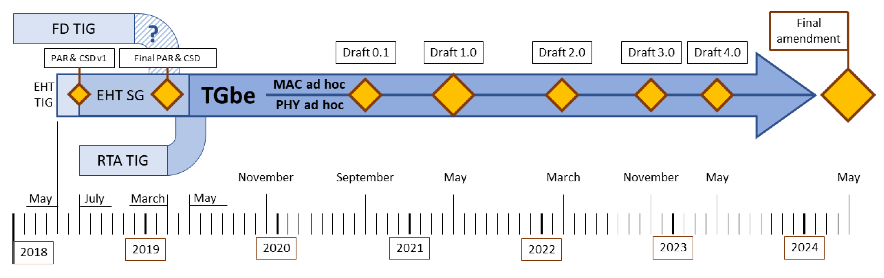

- Primary goal:  define new features of 802.11 on bands between 1 and 7.125GHz with 
- primary objective of increasing **peak throughput** by scaling the PHY of 11ac and 11ax
- Wi-Fi Time-Sensitive Networking (TSN):  to support real-time application (RTA) as a part of the activities of the 802.11 Wireless Next Generation  Standing Committee
- 802.11 WG agreed to provide support of RTA as a part of the future 11be amendment.
- Parallel ad-hoc discussion group of PHY and MAC features.
- Release1: Y2021 
  - 320 MHz, 4K-QAM, obvious OFDMA improvements, multi-link
  - complexity change of phy and mac would postpone to R2
- Consider **Coexistence** with 3GPP technologies of cellular networks operating in the same unlicensed frequency bands 
- IEEE 802.11 Coexistence Standing Committee(Coex SC)  
  - establish contact with 3GPP to set up synchronous work
  - **no technical solutions** have been approved yet in joint workshop in July 2019 in Vienna.
    - no change each technics to align the concurrency.
  - not clear which of the solutions discussed within Coex SC will become a part of Wi-Fi 7

### WI-FI 7 AT A GLANCE

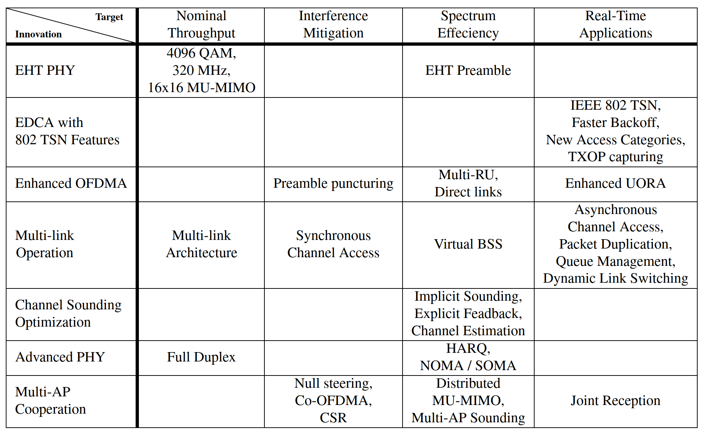

1. EHT PHY
    - 2x BW and nSS in MU-MIMO => 4x increasing
    - 4K-QAM => 20% increasing
    - overall 4.8x increasing vs Wi-Fi 6, i.e. $9.6\times4.8 \approx 46$Gbps
    - generalization of PHY headers and developing a **forward-compatible** frame format.

2. EDCA with 802 TSN Features
   - TGbe examines the main findings of IEEE 802 TSN and discusses how to improve EDCA

3. Enhanced OFDMA
   - Wi-Fi 6 OFDMA drawbacks: reduce spectrum efficiency
     - allows the AP to allocate only one resource unit (RU) of a predetermined size to a client STA
     - not support direct link transmissions
   - Lack of flexibility of the legacy OFDMA 
     - degrades performance in dense deployments and increases the latency
   - TGbe addresses these OFDMA challenges

4. Multi-Link Operation
   - native support of the multi-link operation
   - current chip can use multiple link but independent. limited efficiency.
   - novel sync between the links for increasing channel efficiency.

5. Channel Sounding Optimization
   - Huge overhead from high-dimensional CSI feedback 
6. Advanced PHY Techniques Improving Spectrum Efficiency
   - HARQ
   - Full-duplex (HD)
   - Non-orthogonal multiple access (NOMA)
   - not clear yet (gain vs complexity)
7. Multi-AP Cooperation
   - fully-distributed coordination between nearby APs
   - cooperation between nearby APs: scheduling, beamforming, distributed MIMO.
   - postponed to Release2
     - due to a level of uncertainty related to more complex approaches

## IEEE 802.11BE CANDIDATE FEATURES

### ETH PHY

#### 4K-QAM

- 20% data rate increasing, 
- 40dB SNR requirement: too high for typical Wi-Fi.
- Achieved by BF to get 40dB SNR. (many-antennas AP to few-antenna client)

#### 320MHz

- 6GHz Band brings hundreds of MHz available to Wi-Fi.
- double the maximal nominal throughput.
- improves real data-rate for moderate distance
- 160+160/240/160+80
  - the coexistence of neighboring networks

#### MU-MIMO

- support up-to 16SS across all scheduled STAs
- all SS using the same MCS for complexity consideration
  - although different MCS per SS can gain more capacity.
- need to consider sounding overhead.

#### PHY Frame Format

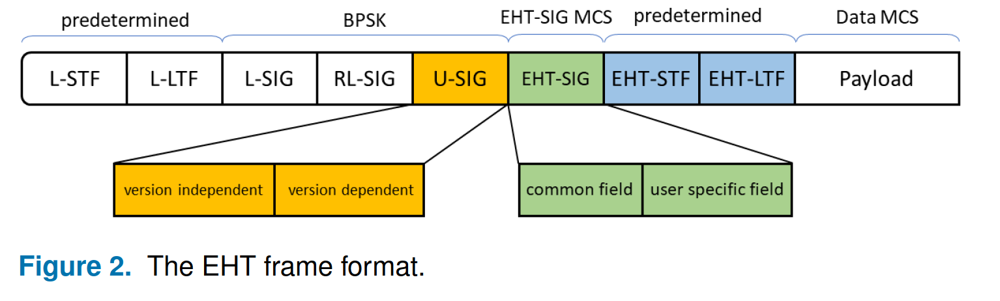 

- Auto detection
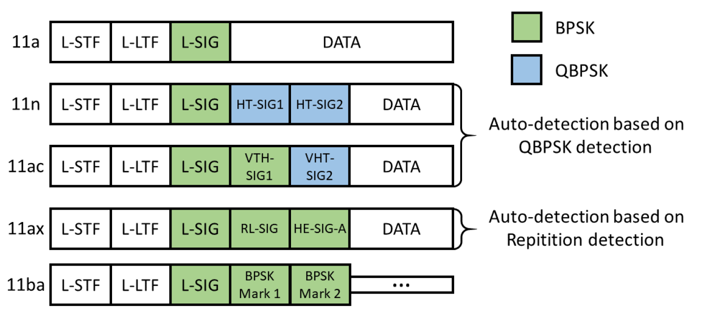 

- 11be and beyond amendments format define:
  - the L-SIG length divisible by 3
  - stop implicit frame-format indication.
  - U-SIG: 
    - two-OFDM-symbol long universal SIG 
    - forward compatibility indication.
    - version independent information + version dependent information 
    - version-independent contains: 3-bit phy indicator, 1bit UL/DL, BSS color, TXOP, bandwidth
    - version-dependent: LTF symbols, mid-amble periodicity, and STBC flag, and some information for 11be features.
- EHT-SIG field consists of the **common field** and a **user-specific** field
  - common field : MCS, nSS, coding, GI, RU allocation
  - user-specific: MU frames, information for individual STA.
  - Trigger frame itself not contain ETH-SIG.
- ETH STF/LTF for fine time and Fo estimation when MIMO/OFDMA is used.
- The phase of every 20 MHz copy is rotated to reduce PAPR
  - including the puncture pattern of the preamble.

#### Open Issues of the EHT PHY

- Sounding overhead
- Flexible OFDMA for wider 320MHz channel to handle frequency selectivity and interferences.
- long preamble for short frame.
- Scheduler algorithm complexity and robustness
  - Multiple antenna/spatial stream gain from advanced scheduler algorithm. 
  - requires low computation complexity and high robustness in scenarios of variable interferences.
- Benefit of large number of SS at AP vs small number at STA for different range of AP-STA is still not clear in real application. need evaluate the new phy performance in real cases. 

### EDCA WITH 802 TSN FEATURES

#### Lessons from IEEE 802 TSN

- TSN network for Realtime application(RTA)
- TSN solution can not directly be applied in Wi-Fi
  - unreliable communication in unlicensed band and random access.
  - hard to guarantee latency and reliability.
- Un-managed operation scenario: 
  - a typical Wi-Fi hot-spot, home or office network.
  - RTA-awareness can improve tp, latency and jitter.
    - but can not guarantee any exact values because overall performance is limited by interference.
- Managed operation scenario
  - factory or enterprise.
  - all BSSs and STAs are managed
  - interference can be controlled
  - network can provide predictable low latency, jitter,and high reliability because of no unmanaged interference.
- Enable RTA in Wi-Fi network: 
  - network to detect the type of operation scenario and set relative solution.
  - Stop on-going transmission of a long **delay-tolerant packet** when an **urgent packet** arrives(QoS)
    - if same device, easily to implement.
    - if different device, need to ask the other to stop ongoing traffic.
    - if air is busy, no control packet can be sent explicitly.
  - Solution in ethernet using collection detection: 搶話、插嘴
    - urgent packet device generates a signal to induce collision at the long packet sender.
    - long packet sender stop the traffic when detecting collision.
    - Cannot directly apply in Wi-Fi since device can not sense channel when TX.
      - workaround: sent busy tone in main or separate channel when a device asking to stop transmission.
  - TSN network widely uses scheduled transmission, it improves worst-case latency.
  - Wi-Fi RTA-aware solution
    - implemented with Hybrid Coordination Function Controlled Channel Access(HCFCCA), but heavy and hardly used in practice.
    - 11ax **trigger frame** is used as workaround to allocated periodic time resource for time-sensitive frames.
    - but trigger based still works on CSMA/CA, cannot guarantee AP able to sent trigger frame in congestion environments. 
    - no protection with Neighborhood interference.

#### Latency analysis for EHT

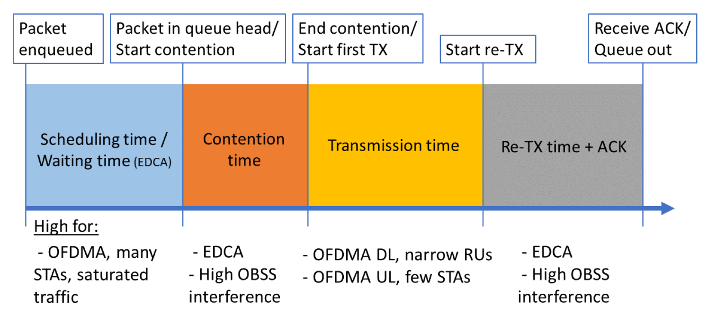

- packet scheduling, channel contention, transmission, retransmission
- Many STA in saturated traffic: high impact on packet scheduling
- Few STA, DL OFDMA : take more on transmission time
  - large RU improves.
- UL OFDMA: TXOP time plays major role.
  - no collision and contention in th scenarios.(which are key latency contributors)
- A shorter trigger frame duration can improve UL latency, but it is not effective in a dense environment

#### EDCA Improvements

- In RTA support, key performance is the worst-case latency. 
  - if small and not frequent RTA, Wi-Fi can achieve without packet loss.
- Wi-Fi bad experience on gaming: suffer lag and high-ping time.
  - Simulation example: video streams requires more traffic than gaming, but still keep better quality since video traffic is prioritized over gaming traffic.
  - Solved by using existing Alternative Voice (A-VO) AC queue for RTA traffic or new ACs. has been done in 802.11aa
- Persistent channel allocation can reduce worst-case latency.
  - RTA is small and periodic, STA can predict next traffic avail and prepare channel beforehand.
- TGbe discuss to modifications of TXOP rules.
  - AP **temporarily** capture TXOP ownership from any associated STA to deliver RTA traffic.
  - AP grant channel access for RTA demanded STA
  - AP return TXOP to original owner when RTA traffic delivered.

#### Open Issues of RTA-aware MAC

### ENHANCED OFDMA

- New in 11be: Assigning multiple RUs to one STA

#### Preamble Puncturing

- Introduced in 11ax to release the under-utilization of channel resource
  - not allocated resource in the sub-channel occupied per 20MHz.
  - allow more flexible RU allocation in dense environment.
- 11be enables punctured transmission for **single user frame**
  - exactly design is actively discussed.
- Additional puncture options considered for 6G channel where other incumbent is present.
- New TXOP mechanism for wider channel frames with puncturing.
  
#### Multi-RU

- in 11ax, an User can only assigned in a Single RU.
  - waste channel resource/capacity is some scenarios.
- 11be allows assign multiple RUs for a single user.
- Main issue: how to reduce overhead and describe the set of RUs most simple.
- Potential proposal:
  - full information only for the first RU of a set of RUs assigned to a STA
  - rest RUs, the description contains only a reference to the first RU of the set
- Coding and interleaving scheme: 
  - if the aggregated size of RUs assigned to a STA is ≤ 80 MHz, **coding and interleaving** shall be done jointly
  - when size exceeds 80 MHz, they shall be done separately for each 80 MHz segment.
- Drawback: implementation and scheduling complexity.
- Proposal limited set of possible combinations.
  - with assumptions of (believe) small/limited gains in frequency diversity
  - divided into two groups : small RU (<20MHz) and large RU(>20MHz), can only combining RUs in the same group.
 
#### OFDMA with Direct Link 

- Two-hop transmission waste resource from STA to AP to STA if STAs are nearby.
- 802.11e enables the direct link from STA to STA directly.
- TGbe has agreed to design a method of how the AP can dedicate channel resources for direct link operation
  - the exact method is under development
- Extends OFDMA to direct-link can avoid collision between two neighbors STAs.
  - AP allocated dedicates RUs for direct link operation. STA ack in the same RU.
  - Proposed AP sends a trigger frame to initialize the direct link.

#### OFDMA for RTA

- OFDMA is a powerful tool for supporting delay-sensitive traffic, since AP can centrally manage DL and UL transmission.
- Need enhancement if need extreme low latency traffic.
- DL and UL transmissions are vulnerable(脆弱) to OBSS interference
  - occurs at a random time, causes collisions, and defers channel access
  - made latency increased even in high average SNR.
- Need to focus on following issues: 
  - allocate RU for STA, important to know the traffic parameters, such as packet remaining life-time.
  - To improve random access for RTA, it is worth allocating RU for RTA packets only.
    - paper study: modify OFDMA random access so that only the STAs that have RTA UL traffic will transmit in the dedicated RU. Such a modification speeds up the collision resolution process and can increase the number of RTA STAs in the network by 50%

#### Open issues of OFDMA

- Flexible preamble puncturing made spectrum fragmentation.
- Efficient usage of OFDMA requires to rethink the scheduling policies implemented in Wi-Fi devices
- RUs in a complex structure in Wi-Fi, resource allocation algorithm not straightforward as LTE.
- With more flexible in RU assignment, scheduling problem will become more challenge. 
- Resource allocation shall depend on the types of traffic to be delivered.
  - Heavy delay-tolerant flows shall be delivered withing the RUs with the highest spectrum efficiency, 
  - while RTA packets require bounded delays
-  802.11 shall consider the exact required values of the QoS parameters for improve quality of user experiences.

### MULTI-LINK OPERATION

#### Legacy Approaches for Wide Spectrum Usage
 
- Wider channels are used to enhance throughput and reduce delay.
- not efficient due to 
  - all transmission are not full Synchronized
  - channel access controlled by primary 20 band: wide channel will be blocked if primary is busy.
  - wide channels consume more power, it is crucial to mobile device.
  - increase wide channels increase the tone number and PAPR.
  - different property and interference level in the different channels, need different channel access parameter and mechanism.
- Off-the-shelf APs provides Dual- / Tri-band operation, MAC and PHY of various bands work independently and provide multiple independent link to STAs.
- 11Be try to find such a level of synchronization between various link to provide high spectrum efficiency, low delays, and low power consumption.
  - extend multiple band functionality of 11ad/11ay.
  - allow sending packet concurrently in multiple channels.
  - channels occupied in different or same band.
  - multi-link can aggregate various numbers of links with different bandwidth, such as 160+20.

#### Multi-link Architecture

- Multi-Link Device (MLD)
  - consists of several so-called affiliated Wi-Fi devices (multiple phy)
  - single interface to LLC(link-level controller)
  - upper layer consider MLD as single device. Single MAC address.
  - Sequence number generate unique from the same sequence number space.
    - Simplified fragment, package reassembly, duplication detection and dynamic link switching.

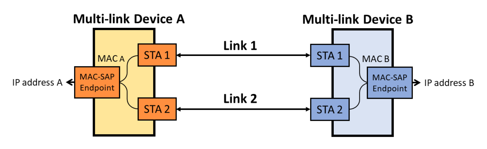

- TGBe discuss establish a connection (association, authentication) with MLD on various affiliated devices may occur indecently or jointly.
  - if jointly, all link capability should be explicitly indicated.
- Two operations: **restricted** and **dynamic link switch**
  - restricted mode:
    - data frames and ACKs are bound to one link
    - management frame over one link(power-save, security key, BA..)
  - dynamic link switch mode:
    - multiple links can be used for transmission of the same flow
    - management in one link can apply to the other link.
    - enables load balancing and congestion avoidance, improve peak, reduce latency, overhead, power consumption.
    - this mode requires reconsidering the protocol limitations of the mentioned mechanisms.

#### Multi-link Channel Access

- Asynchronous transmission:
  - MLD do simultaneously transmission through different bands or the same band.
  - For the same-band operation, when sharing same antenna for affiliated devices, will cause interference between the links.
- Synchronization transmission prevents the interference for co-located antenna in neighboring channels.
- Another proposal: forbidden transmission during the transmission of the intended receiver
  - transmit in one link, can not receive at the other. 
  - to receive BA successfully, should stop transmission.
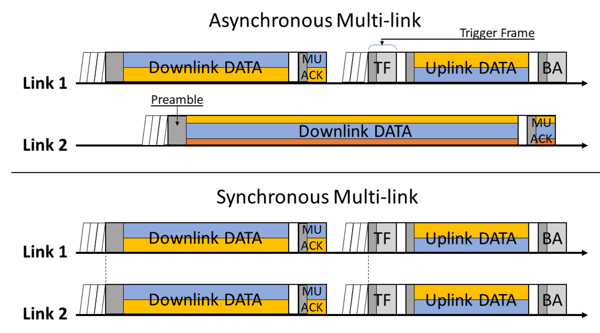

#### Multi-link Power Save

- At least "two device" in MLD, require good power management especially in mobile device.
- MLD exchange the power management information to each other links.

#### Multi-link Operation for RTA

- prospective approach to enhanced reliability and reduced latency in TGbe
- Two mode operation in RTA TIG: Duplicate Mode and Joint Mode.
  - Duplicate mode: 
    - send copies to multiple links. 
    - once one of the link received the data, it drops all of copies to deliver later.
    - Provide robustness transmission.
  - Joint mode: transmitter produces no copies but distributes frames over available links
    - Reduce latency.
- Conditional Packet Duplicated Mode: 
  - MLD initially tries to deliver a frame only via one link, 
  - if not success, it replicates the packet and deliver it via other links with the **highest** priority

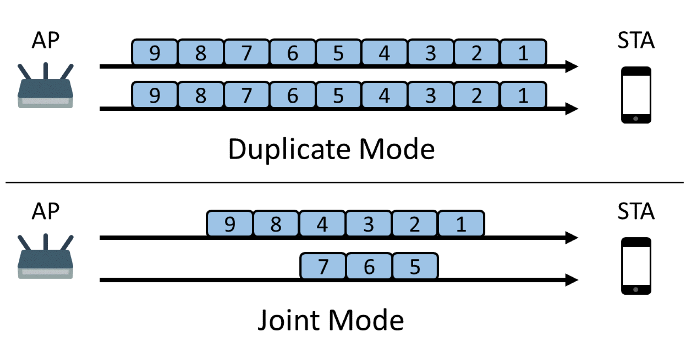

#### Open Issues of Multi-link

- Many issues from Sync/Async transmission of the MLD.
- Asynchronous Operation: need to enhance the latency and reliability of RTA data.
- Synchronous channel access: organization of sync access is still open.
  - A primary channel: provides rare channel access
  - All links could participate concurrently: has a potential fairness issue
- Need mathematical model to evaluate and optimize their performance in case of finite flows.
- Algorithm of packet distribution  among multiple links shall both **minimize channel wasting** and prevent the **head-of-line blocking delay** 

### CHANNEL SOUNDING OPTIMIZATION

#### Channel sounding induced overhead

- Channel properties significantly vary with time
- Sounding CSI data increasing by $N_c\times N_r$
- Example of ratio of  overhead vs payload data
- Key challenge is to reduce sounding overhead and BF Report(BFR).
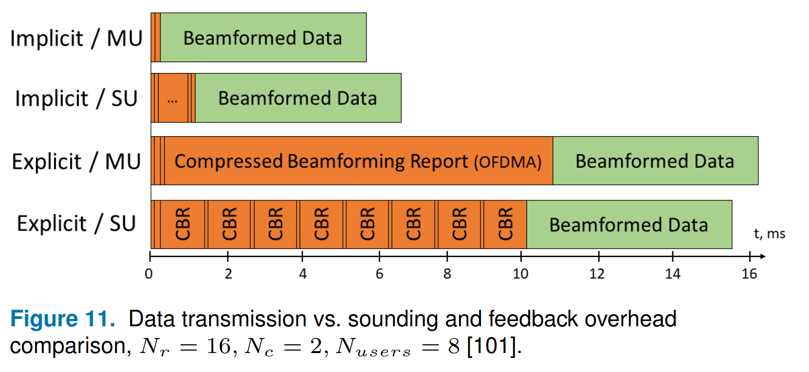

#### Sounding Enhancements

- Sounding P matrix for high-dimension
  - Fourier transform bases as baseline.
    - no (±1, ±𝑗)-matrices of sizes 9/11/13/15; and no (±1)-matrices of sizes 9/10/11/13/14/15
  - Large P matrix with Zero entities.
    - make fewer computations at RX.
- Shorten training period: (256us for 16ss)
  - Tone-interleaved sampling
    - a periodic sequence per SS to reduce the training sequence.
    - RX interpolates channel response per SS.
  - Orthogonal Sequence-based Reference Signal(OSRS)
    - groups of tones are orthogonal code for each streams.
    - rx to determinate the response per stream per group.
    - currently OSRS performance worst than tone-interleaving scheme due to cross-stream leakage.

#### Explicit Feedback Overhead Reduction

- Reduce BFR size.
- wideband precoding: implement a wideband precoder by averaging the channel over all the tones
  - shrinks the feedback information manyfold with some degradation in the accuracy and, consequently, performance
  - in high order MIMO, loss is significant.
- Narrow-band precoding at top of wideband precoding: 
  - improve wideband beamforming, still keeps the precoding matrix smaller than per tone-based.
  - use the same basic HW used in legacy Wi-Fi.
  - reduces the overhead by 25-30% with 0.5dB loss and 70% reducing with 1dB loss 
- Ignore very small value can furthermore reduce the overhead
  - study in TGnD channel, 20% of response < 1% total power.

#### Implicit Sounding

- Reintroduce implicit sounding proposed in 11n.
  - not used in off-the-shelf product due to complicated self-calibration procedure.
- Implicit sounding: STA send NDP to AP, AP measures response directly from STA.
  - improve scheduling and spectrum efficiency
  - need to calibrate non reciprocal properties of BB-to-RF and RF-to-BB.
- Self-calibration procedure: AP sent training sequence from reference antenna to the other, and derivate the relative offset/gain of the BB-to-RF .
- Trigger-based implicit sounding: 
  - AP starts with a trigger frame requesting for STA UL NDPs
  - STA reply NDPs with orthogonality P matrix or subcarrier interleaving
  - save more than 60% of original airtime.

#### Open issues of Channel Sounding

- Tradeoff between overhead and the performance with interleaving scheme or OSRS, and the compress scheme.
- Implicit sounding is still debatable: 
  - drawback: low performance caused by weak uplink
  - STA may need longer reference signals.
- Implicit sounding procedure in multi-AP operation.

### ADVANCED PHY TECHNIQUES IMPROVING SPECTRUM EFFICIENCY

#### HARQ

- HARQ exploits the information from the previous tries
  - provides more robust to error and allow TX to send a higher QAM opportunistically.
  - avoids reducing MCS for such retries
- HARQ schemes: chase combining (CC), punctured CC, and Incremental redundancy(IR)
  - CC: each retry use the same info. low complexity.
  - punctured CC: TX retransmit a portion of the coded bits, reduce HARQ-induced overhead.
  - IR: every retransmission uses a different set of coded bits, every RX gain extra info. most difficult to implement, most efficient.

- HARQ introduces issues in Wi-Fi system. 
 
##### Data unit

- Wi-Fi MPDU has check sum. if check failure, repeat whole MPDU.
- HQRQ inherent legacy Wi-Fi MPDU cause many issues: 
  - original and re-try carry different informations: retry bit, ciphertext, CRC bits, scramblers... hard to direct combine.
  - if MDPD is encapsulated in AMPDU, LDPC codeword not align to MDPU in AMPDU, How the TX generate the failure MPDU? 
    - repeat whole AMPDU ? too much overhead.
  - repeat in damaged FEC codeword : 
    - receiver required to identify erroneous codewords at the PHY. Codeword has no check sum.
    - Can use parity bits with MPDU check sum, and request the associated failure codeword with MPDU. 
    - need tight MAC-PHY interaction and cause implementation issues.
  - Group several codeword as HARQ block.
    - lower overhead on BA and feedback.
    - incur overhead on MAC padding.
    - HARQ Blocks could contain multiple MPDUs and their fragments: retransmission overhead will be large if a fragmented MPDU fails

  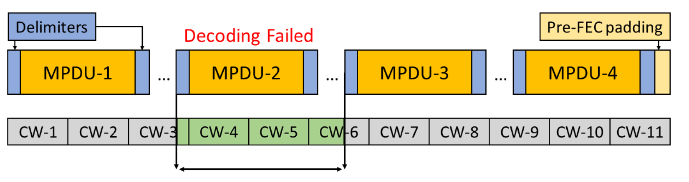 

##### Protocol

- Adopting BA mechanism, suits best for MPDU and HARQ Block units
  - feedback overhead is small, but retransmission overhead is large
- BA in codeword level is problematic because of necessary of additional MAC-PHY interaction.
- Codeword-level HARQ can bypass MAC, but need to define new protocol for PHY retransmission.
- HARQ retransmission in new TXOP or original TXOP.
  - in new TXOP, AP need to support many HARQ process. and increasing memory requirement.
  - in original TXOP, HARQ retransmission is limited by TXOP duration. Sender may need to choice long enough TXOP for both transmission and retransmission and cause wasting resource.
- Multi-link HARQ: retransmission in different channel/link.
- Multi-layer HARQ: mapping codeword and retransmission in different QAM bits by leveraging different reliability of the bits. 
  - can improve low SNR reliability.
- Evaluation of  codeword puncturing  and construction for HARQ is required.
- TGbe discusses introducing additional retry counter for HARQ retransmission attempts.

##### Implementation issues

- **Memory-hungry technique** : receiver saves log-likelihood ratios (LLRs) for received bits
- HARQ operations shall be done very quickly
  - LDPC is iteration-based solution, new info would shorten the iteration process.
  - codeword-based HARQ, MAC processing shall be accelerated.
- Performance of HARQ in Wi-Fi deployments is still an open issue
  - HARQ benefit in extreme low SNR.
  - the performance of HARQ is not well studied in dense deployments

#### Full-Duplex

- In-Band FD allows simultaneous UL and DL on the same spectrum
  - maximize spectrum efficiency, shorten latency.
  - collision reduction: DL signal prevents potential hidden nodes from transmitting during UL
  - relax issues for relay-based networks, multi-relay support FD can transmit simultaneously.
  - "Listen while talk": new version of channel access schemes. 
- Hard implement in Wi-Fi(Wireless): rapid channel variations and MIMO
- Successive interference cancellation (SIC): 
  - mitigate internal reflections: 15-20dB lower than TX, non-linear components ~ 30-40dB, multipath ~ 50-60dB 
  - Analog SIC: cancel strongest path
  - Digital SIC:interference below noise floor.
  - Operate correctly only if the STA knows the figure of its **internal reflections** and **non-linearity**.
    - need to enable calibration procedure.
- Currently, none of the FD solutions received sufficient support within TGbe because of unclear gains in real deployments.

#### Non-orthogonal Multiple Access

- NOMA to increase peak throughput and improve efficiency
- AP perform NOMA transmissions with the superposition coding
  - the bigger is the power, the more reliable is the component reception
  - two-STA case: the great-power component to a far STA with worse channel conditions, the other component to a near STA.
    - Far STA: composite signal as noise
    - Near STA: perform SIC
- Semi-orthogonal Multiple Access (SOMA): artificially designed gray-mapped superposed constellation
  - low-power signal component more resilient to noise
  - SIC becomes unnecessary, relax complexity.
- Performance gain: 
  - in 3GPP 20 − 30% gain of the feature is already proven in both Link and System Level
  - experimental study of NOMA/SOMA Wi-Fi systems up to 40% gain of the geometric average throughput for two STAs.
- Backward-compatible: the far STA can be legacy !!
- NOMA is complementary to MU-MIMO
  - MU-MIMO: STA in similar attenuation but orthogonal MIMO
  - NOMA: better with the STAs that have **dissimilar attenuation** and correlated channels
- There are plenty of theoretical works dedicated to MU-MIMO and NOMA cooperation.

### MULTI-AP COOPERATION

#### Basic idea

- a paradigm shift from interference mitigation to cooperation between the neighboring APs.
- state-of-the-art enterprise Wi-Fi networks enable seamless roaming between Wi-Fi networks and simplify network configuration
- TGbe discuss to allow multi-AP system, which can have a distributed or centralized coordination
- Two type multi-AP system: Coordinated and Joint
  - Coordinated: systems send/receive each portion of data by a single AP
  - Joint: systems send/receive data by multiple APs
- Coordinated spatial reuse(CSR):  an evolution of spatial reuse (SR) system introduced in 802.11ax
  - APs mitigate interference by coop-eratively controlling TX power
  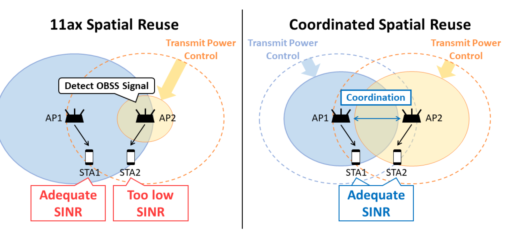 
- Coordinated OFDMA (Co-OFDMA)
  - allows the APs to coordinate their schedules in time and frequencies
  - Nearby APs can assign the same RUs for some STAs if interfere.
- Null Steering
  - Coordinated beamforming CBF
  - AP perform beams to their STA, target to null its interference to neighboring STAs.
  - Avoid mutual interference nearby network.
  - challenge: acquire CSI from the non-served STAs associated to other APs.
- Joint Transmission and Reception
  - multiple APs to serve the same STA by creating a dynamic distributed MU-MIMO system
  - Highest profit in joint transmission and reception of all multi-AP.
  - Too complicated and has severe requests: high speed backhaul, accurate synchronization.
- Joint transmission and reception methods require joint signal processing at the APs. 
 
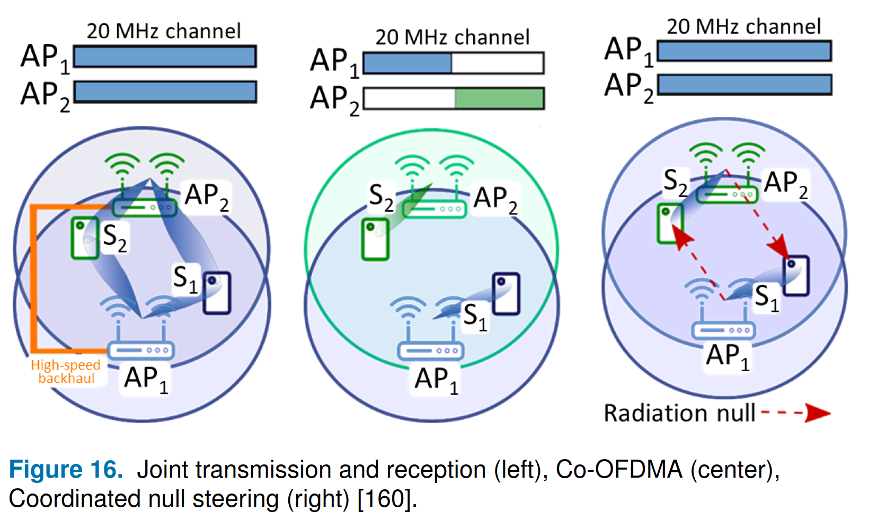

- Synchronization Requirements:
  - CSR: frame-level
  - Co-OFDMA: symbol-level timing sync
  - CFB: tight timing and phase sync.
  - JTX: additional the same data for transmission.
  - JRX: exchange signal samples.
  - CSR and Co-OFDMA the most likely to be supported in the TGbe

#### Sounding

- Multi-AP start with sounding procedure.

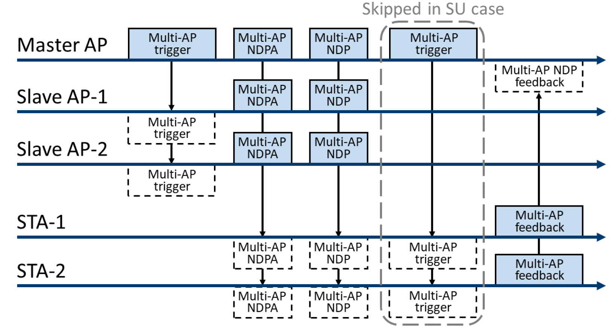

- major issue: BFR overhead for high-order MIMO.
  - interleaving scheme.
  - STA not ack for poor channel quality.

- Slave AP selection: 
  - master AP select AP tp serve which STA.
  - wrong selection causes **anticipated gain**

#### Collecting Acknowledgments

- In JTX, APs to synchronize information about the delivery of each frame
  - each AP may listen to all the BAs
  - disseminate information about heard BAs to the rest of APs.
- Simplified approach: one AP to collect Ack and share to the others.

#### Virtual BSS

- Seamless exchange of frames between a STA and a group of APs without negotiation overhead
- Virtual BSS:  All the APs of the set share the association/authentication and can have the same BSS ID 
- STA do not need to re-association if it change physical AP serving after associated to virtual BSS.

#### Implementation Issues

- Coexistence with other network.
- Require tight synchronization. 
- Multi-AP assumes that in an enterprise network.
- Multi-AP operation requires advanced scheduling techniques
  - Even in simple Co-OFDMA, the APs need to exchange information about channel resource demands.
- sounding mechanism not been studied for UL
- Centralized/Decentralized Multi-AP scheduling raises the fairness issue.
- JTX/JRX open issues: 
  - time/frequency/phase sync.
  - midamble in long packet to reduce the negative effect.