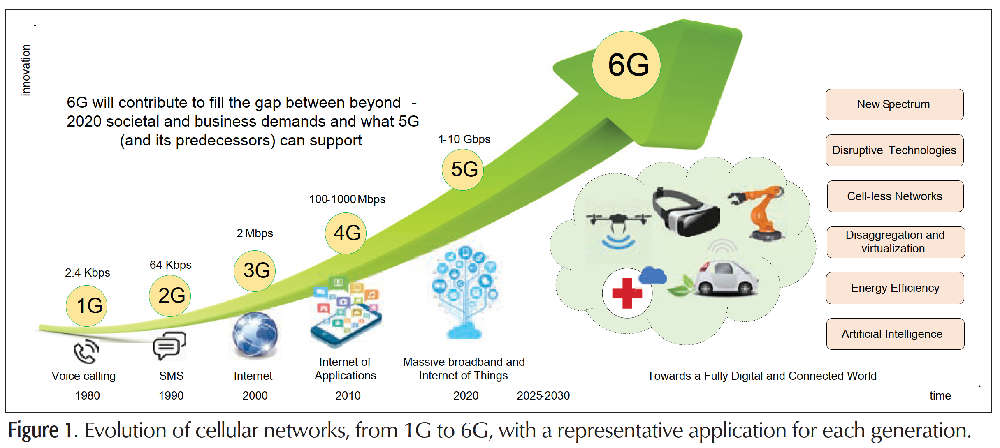

# Toward 6G Networks: Use Cases and Technologies

- Full digital and connected World : Move from personal communication to Full IoT
  - Data-centric, data-dependent and  automated society
  - Automatic industry manufacturing processes
  - Autonomous transportation systems (road,ocean, air..)
  - Smart city, home with millions of sensors 
  - New systems operated by artificial intelligence in local cloud and fog environments
  - move from personalized communication toward the full realization of the Internet of Things (IoT) paradigm
    - connecting the computing resources, vehicles, devices, wearables, sensors, and even robotic agents

    

- 5G a significant step toward a low-latency tactile access network
  - New frequency bands, mmWave
  - Advanced spectrum usage and management
  - redesign of core network
- Resource requirement of data centric and automated process may exceed 5G system
  - throughput in terabit per second
  - latency < ~x00 us
  - connected nodes in $10^7$ per $km^2$
- Envision in 6G:
  - Novel disruptive communication technologies(新的破壞性通訊技術)
    - terahertz and optical communications
  - Innovative network architectures(創新的網路架構)
    - 3D coverage calls for new cell-less architectural
    - disaggregation and virtualization of the networking equipment
  - Integrating intelligence in the network(整合智能網路)
    - bring intelligence from centralized computing facilities to end terminals
    - distributed learning models
    - Unsupervised learning and knowledge sharing for realtime network decision.