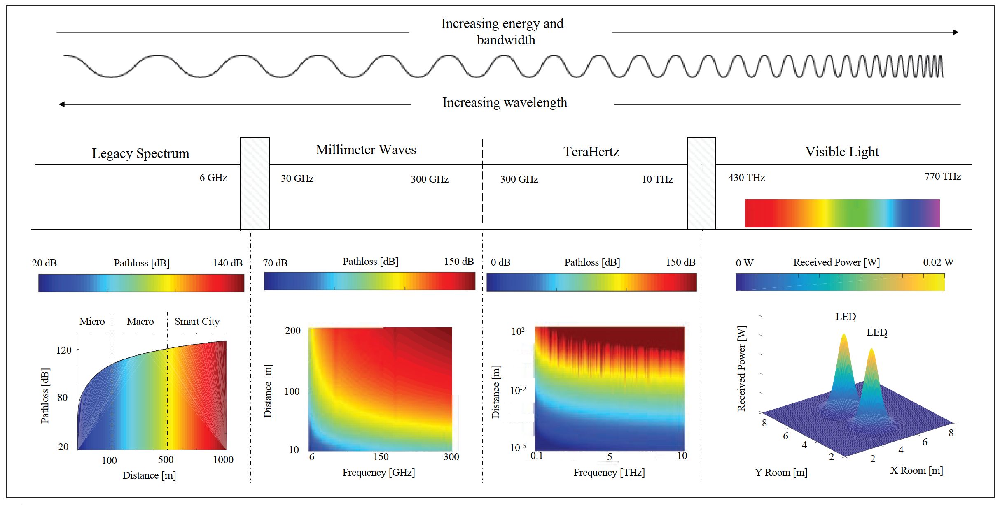

# Toward 6G Networks: Use Cases and Technologies

- Full digital and connected World : Move from personal communication to Full IoT
  - Data-centric, data-dependent and  automated society
  - Automatic industry manufacturing processes
  - Autonomous transportation systems (road,ocean, air..)
  - Smart city, home with millions of sensors 
  - New systems operated by artificial intelligence in local cloud and fog environments
  - move from personalized communication toward the full realization of the Internet of Things (IoT) paradigm
    - connecting the computing resources, vehicles, devices, wearables, sensors, and even robotic agents

    

- 5G a significant step toward a low-latency tactile access network
  - New frequency bands, mmWave
  - Advanced spectrum usage and management
  - redesign of core network
- Resource requirement of data centric and automated process may exceed 5G system
  - throughput in terabit per second
  - latency < ~x00 us
  - connected nodes in $10^7$ per $km^2$
- Envision in 6G:
  - Novel disruptive communication technologies(新的破壞性通訊技術)
    - terahertz and optical communications
  - Innovative network architectures(創新的網路架構)
    - 3D coverage calls for new cell-less architectural
    - disaggregation and virtualization of the networking equipment
  - Integrating intelligence in the network(整合智能網路)
    - bring intelligence from centralized computing facilities to end terminals
    - distributed learning models
    - Unsupervised learning and knowledge sharing for realtime network decision.

## 6G Use Cases

- meet stringent network demands (e.g., ultra-high reliability, capacity, efficiency, and low latency) in a holistic fashion, in view of the foreseen economic, social, technological, and environmental context of the 2030 era.

  - AR/VR: 100Mbps per user to 1G per user, 20Gbps total to 1Tbps from 5G to 6G
  - Holographic telepresence (teleportation)
    - 3D holographic display
    - latency < ~100 us
  - eHealth:
    - require from 99.999% to 99.99999% reliability
  - Pervasive connectivity:
    - higher overall energy efficiency (10–100x with respect to 5G)
    - provide seamless and pervasive connectivity in a variety of different contexts, matching stringent QoS requirements in outdoor and indoor scenarios with a cost-aware and resilient infrastructure
  - Industry 4.0 And robotics
    - microsecond delay jitter
    - gigabit-per-second peak data rates for AR/VR industrial 
  - Unmanned Mobility
    - ultra-high-mobility scenarios (up to 1000 km/h) to guarantee passenger safety

## 6G Enabling Technologies

| Tech         | Cat                                           | Potential                                                           | Challenges                                                   | Use Cases                                                                                  |
| ------------ | --------------------------------------------- | ------------------------------------------------------------------- | ------------------------------------------------------------ | ------------------------------------------------------------------------------------------ |
| New Spectrum | TeraHz                                        | high BW, small antenna, focus beams                                 | Circuit design, high propagation loss                        | Pervasive connectivity, industry 4.0, holographic telepresence                             |
| New Spectrum | VLC                                           | Low-cost hardware, low interference,unlicensed spectrum             | Limited coverage, need for RF uplink                         | Pervasive connectivity, eHealth                                                            |
| PHY          | Full duplex                                   | Continuous TX/RX and relaying                                       | Management of interference, scheduling                       | Pervasive connectivity, industry 4.0                                                       |
| PHY          | Out-of-band channel estimation                | Flexible multi-spectrum communications                              | Need for reliable frequency mapping                          | Pervasive connectivity, holographic telepresence                                           |
| PHY          | Sensing and localization                      | Novel services and context-based control                            | Efficient multiplexing of communication and localization     | eHealth, unmanned mobility, industry 4.0                                                   |
| Network      | Multi-connectivity and cell-less architecture | Seamless mobility and integration of different kinds of links       | Scheduling, need for new network design                      | Pervasive connectivity, unmanned mobility, holographic telepresence, eHealth               |
| Network      | 3D network architecture                       | Ubiquitous 3D coverage, seamless service                            | Modeling, topology optimization and energy efficiency        | Pervasive connectivity, eHealth, unmanned  mobility                                        |
| Network      | Disaggregation and virtualization             | Lower costs for operators for massively-dense deployments           | High performance for PHY and MAC processing                  | Pervasive connectivity, holographic telepresence, industry 4.0, unmanned mobility          |
| Network      | Advanced access-backhaul                      | integration Flexible deployment options, outdoor-to-indoor relaying | Scalability, scheduling and interference                     | Pervasive connectivity, eHealth                                                            |
| Network      | Energy-harvesting and low-power operations    | Energy-efficient network operations, resiliency                     | Need to integrate energy source characteristics in protocols | Pervasive connectivity, eHealth                                                            |
| Intelligence | Learning for value of information assessment  | Ontelligent and autonomous selection of the information to transmit | Complexity, unsupervised learning                            | Pervasive connectivity, eHealth, holographic telepresence, industry 4.0, unmanned mobility |
| Intelligence | Knowledge sharing                             | Speed up learning in new scenarios                                  | Need to design novel sharing mechanisms                      | Pervasive connectivity, unmanned mobility                                                  |
| Intelligence | User-centric network architecture             | Distributed intelligence to the endpoints of the network            | Real-time and energy-efficient processing                    | Pervasive connectivity, eHealth, industry 4.0                                              |

### Disruptive Communication technologies

- 6G networks: conventional spectrum (sub-6 GHz and mmWaves) + new frequency band(terahertz ,visible light communications)

#### Terahertz Communications

- between 100 GHz and 10 THz
- high-frequency connectivity enabling data rates(~x00 Gbps).
- main issues: propagation loss, molecular absorption, high penetration loss, RF and Antenna
  - propagation loss
    - directional antenna arrays (like mmWave)
    - spatial multiplexing with limited interference
  - molecular absorption: select the operating band not affected by.
  - limited to indoor-to-indoor scenarios
  - RF and antenna: ultra-small-scale electronic packaging solutions.

#### Visible Light Communication

- quickly switch between different light intensities to modulate a signal that can be transmitted to a proper receiver
- more mature than that on terahertz communications
- Applied in indoor application
  - limited coverage range
  - require an illumination source
  - suffer from shot noise from other light sources
- Need to be complemented by RF for the uplink
- Standard: IEEE802.15.3d and IEEE802.15.7
  - not included in Cellular network
  - targeting beyond 5G use cases
- Research for enable 6G mobile users to operate in the terahertz and VLC spectra
  - hardware and algorithms for flexible **multi-beam acquisition** and tracking in **non-line-of-sight (NLoS)** environments

#### Full-Duplex Communication Stack

- key on reducing the cross-talk between TX/RX
- enable concurrent downlink and uplink transmission increasing multiplexing capability
- 6G network careful planning to avoid interference

#### Novel Channel Estimation Techniques (e.g.,Out-of-Band Estimation and Compressed Sensing)

- Difficult to design **efficient procedures** for **directional** communication, considering very large BW in mmWave and Terahertz
- Out-of-band estimation(angular domain) improves relativeness of beam management
- Angle domain sparsity: exploit **compressive sensing** to estimate the channel using a reduced number of samples

#### Sensing and Network-Based Localization

- 6G networks will exploit a unified interface for localization and communications to improve control operations: 
  - information to shape beamforming patterns, reduce interference, predict handovers, and innovative user services

### InnovAtIve network ArchItectures 