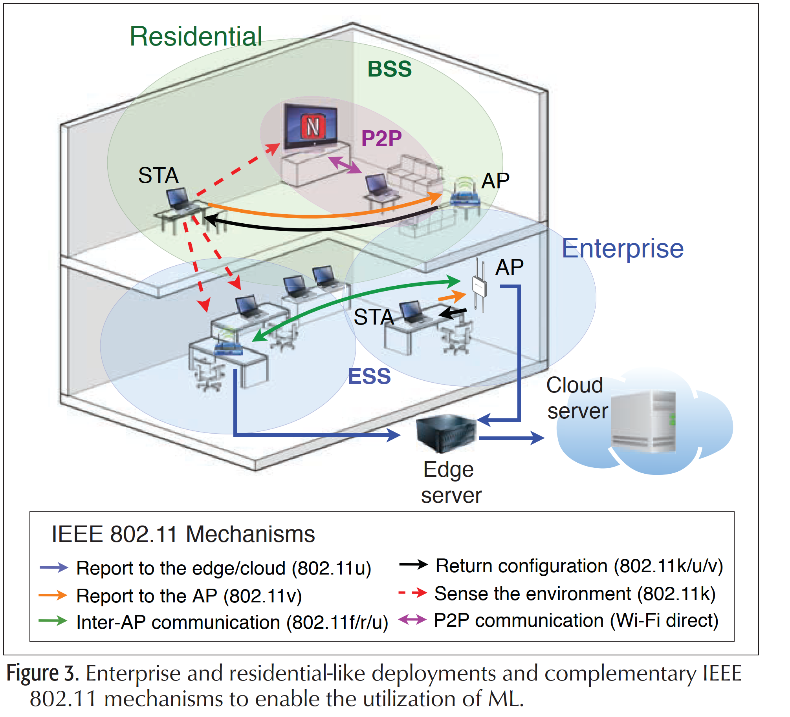

# A Flexible Machine-Learning-Aware Architecture for Future WLANs

- IEEE Communications Magazine • March 2020
- Challenge of future communication
  - bandwidth: 10-20Gbps
  - latency: < 5ms
  - loss: packet-error rate < 1e-5
  - scalability: 1e6 per km^2
- Paradigm shift in designing for network planning, operation and management
  - empower on cognitive and context-aware capacity
  - need additional information: environment sensors, camera.

## Machine-Learning-enabled use cases in WLANs

### OFDMA-Based Smart Network Slicing

- network slicing: allows virtually separating network resources to meet diverse application requirements
- thru resource allocation in OFDMA.
- ML **predicts on the user requirements** to optimize access network

- predict resource requirement by ML, allocated to ofdma resource

- 5G network slicing is a network architecture that enables the multiplexing of virtualized and independent logical networks **on the same physical network infrastructure**. Each network slice is an isolated end-to-end network tailored to fulfil diverse requirements requested by a particular application.

### Cloud-Based User Association and Hand-over

- HO typical rely on the strongest signal first (SSF) mechanism
  - has loading balancing issue
  - performance loss in dense BSSs
- provide contextual information such as traffic load.
- **mobility pattern prediction** using ML to empower association and HO process

### Inference-Based Coordinated Scheduling

- WLAN deployments can be chaotic
  - complex scenarios where inter-BSS inter-actions prevent the existing scheduling approaches from ensuring a minimum quality of service
- Thru coordinated **ML-assisted scheduling**, different APs can trigger uplink/downlink transmissions from/to the appropriate stations (STAs)
  - increasing the network throughput while 
  - reducing the number of packet collisions

### Reinforcement-Learning-Based Spatial Reuse

## Future Network

- FG-ML5G was 
- November 2017 by its parent group, ITU-T Study Group 13
- to study the integration of ML mechanisms into future networks.

### Multi-level machine learning pipeline

- Source (Src)
- Collector(C)
- Pre-processing(PP)
- Model(M)
- Policy(P): constrain of guideline delimit behavior of model.
- Distributor(D): spread ML output across all corresponding targets.
- Sink:

### Closed-loop subsystem

## ML-aware arch for IEEE WLAN

### WLAN two deployment classes

- Residential 
- Enterprise 

### Challenges

- Non-stationary: 
  - channel fluctuations, mobility user, varying traffic made netwrok dynamiclly, 
  - **continuous re-training** ML.
- Limited Communication Resources: 
  - unlicensed bands shared resource, ML mechanism may be fail or delay due to conjunction. 
  - ML operation must be **robust and resilient**.
- Limited Computation and Storage Resources: 
  - scarce resource in WLAN special in residential environments
  - ML needs computation-efficient procedures, limited resources for online learning.
- Adversarial Environment
  - chaotic in overlapping BSSs
  - competition among agents may lead to an adversarial setting
  - different ML mechanisms in multi-vendor devices, leading to clashing interests.
- Legacy Devices

### Computation Paradigm in IEEE 802.11 WLANs

- Cloud-oriented: high computational and storage resources
  - relay on management of data and the corresponding synchronization, availability, and heterogeneity issues
- edge-oriented:
  - lack powerful computation and storage resources
  - only allow using simple and lightweight computing ML algorithms
  - for real-time ML applications that manage local (and even highly varying) information.

### Realization 

- Training procedure  
  1. Data collection
     - from different ap,sta, collects 
     - user info, performance, application data, channel states,...
  2. Pre-processing  
  3. Model generation
  4. Output distribution 
- Placement 
  - Handle new requests
  - Pre-processing
  - Run the ML solution
  - apply solution
- Sandbox(simulated environment!)
  - Generate data for training
  - Preliminary model testing

### Example study: AP association/HO problem

