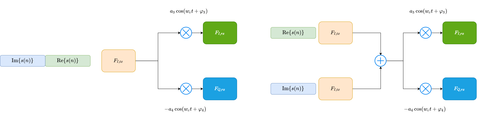

# Frequency-Selective Joint T x/Rx I/Q Imbalance Estimation Using Golay Complementary Sequences

- IEEE TRANSACTIONS ON WIRELESS COMMUNICATIONS, VOL. 12, NO. 5, MAY 2013
- R. Rodr´ıguez Avila, G. Nunez-Vega, R. Parra-Michel, and A. Mendez-Vazquez

## Abstract
- TRX Modeling
  -  
  - $s _ { r } ( n ) = \left( \gamma _ { T x } ( n ) * \gamma _ { R x } ( n ) * h ( n ) + \beta _ { T x } ^ { * } ( n ) * \beta _ { R x } ( n ) * h ^ { * } ( n ) \right) * s ( n )
\left( \gamma _ { R x } ( n ) * \beta _ { T x } ( n ) * h ( n ) + \beta _ { R x } ( n ) * \gamma _ { T x } ^ { * } ( n ) * h ^ { * } ( n ) \right) * s ^ { * } ( n ) + \gamma _ { R x } ( n ) * \eta ( n ) + \beta _ { R x } ( n ) * \eta ^ { * } ( n )$
  - $\begin{aligned} \gamma _ { T x } ( n ) & = \frac { f _ { L , T x } ( n ) + g _ { T x } e ^ { j \varphi _ { T x } f _ { Q , T x } ( n ) } } { 2 } \\ \beta _ { T x } ( n ) & = \frac { f _ { I , T x } ( n ) - g _ { T x } e ^ { j \varphi T x } f _ { Q , T x } ( n ) } { 2 } \\ \gamma _ { R x } ( n ) & = \frac { f _ { I , R x } ( n ) + g _ { R x } e ^ { - j \varphi _ { R x } f _ { Q , R x } ( n ) } } { 2 } \\ \beta _ { R x } ( n ) & = \frac { f _ { I , R x } ( n ) - g _ { R x } e ^ { j \varphi _ { R x } f _ { Q , R x } ( n ) } } { 2 } \end{aligned}$

- Response of The model
  - 
  - DFT representation: 
    - $S _ { r } ( k ) = \Gamma ( k ) S ( k ) + B ( k ) S ^ { * } ( - k )$
    - $\Gamma _ { T x } ( k ) = \frac { F _ { I , T x } ( k ) + g _ { T x } e ^ { f \phi T x } F _ { Q , T x } ( k ) } { 2 }$
$B _ { T x } ( k ) = \frac { F _ { I , T x } ( k ) - g _ { T x } e ^ { j \varphi T x } F _ { Q , T x } ( k ) } { 2 }$
$\Gamma _ { R x } ( k ) = \frac { F _ { I , R x } ( k ) + g _ { R x } e ^ { - j \varphi _ { R x } } F _ { Q , R x } ( k ) } { 2 }$
$B _ { R x } ( k ) = \frac { F _ { I , R x } ( k ) - g _ { R x } e ^ { j \varphi _ { R x } } F _ { Q , R x } ( k ) } { 2 }$

- Estimation and Compensation in Frequency Domain
  - $\left[\begin{array}{c}S_{r}(k) \\ S_{r}^{*}(-k)\end{array}\right]=\left[\begin{array}{cc}\Gamma & B \\ B^{*} & \Gamma^{*}\end{array}\right]\left[\begin{array}{c}S(k) \\ S^{*}(-k)\end{array}\right]=\mathbf{D}\left[\begin{array}{c}S(k) \\ S^{*}(-k)\end{array}\right]$
  - $S(k)=F_{1} S_{r}(k)+F_{2} S_{r}^{*}(-k)$
  - $F_{1}=\frac{\Gamma^{*}}{|\Gamma|^{2}-|B|^{2}}$,    $F_{2}=\frac{-B}{|\Gamma|^{2}-|B|^{2}}$
  - $F_{1}(k)=\frac{\Gamma^{*}(-k)}{\Gamma(k) \Gamma^{*}(-k)-B(k) B^{*}(-k)}$, $F_{2}(k)=\frac{-B(k)}{\Gamma(k) \Gamma^{*}(-k)-B(k) B^{*}(-k)}$

- Golay  Complementary Sequence
  - $S_{a L}(n) \odot S_{q L}^{\prime}(n)+S_{b L}(n) \odot S_{b L}^{\prime}(n)=0_{L}$
  - $S_{a L}(n) \odot S_{b L}^{\prime}(n)+S_{b L}(n) \odot S_{a L}^{\prime}(n)=0_{L}$
  - $S_{a L}(n) \odot S_{a L}(n)+S_{b L}(n) \odot S_{b L}(n)=2_{L}$
  - $S_{q L}^{\prime}(n) = S_{a L}(L-n-1)$
- Receiving Using GCS Training
  - Receiving model: 
    - $S_{r a}(k)=\Gamma(k) S_{a}(k)+B(k) S_{a}^{\prime}(k)$, $S_{r b}(k)=\Gamma(k) S_{b}(k)+B(k) S_{b}^{\prime}(k)$
  - Estimation algorithm
    - $\Gamma(k)=\frac{1}{2}\left\{S_{r a}(k) \odot S_{a}(k)+S_{r b}(k) \odot S_{b}(k)\right\}$,
    - $B(k)=\frac{1}{2}\left\{S_{r a}(k) \odot S_{a}^{\prime}(k)+S_{r b}(k) \odot S_{h}^{\prime}(k)\right\}$
  - Derivation: 
    - $C_{a}(k)=S_{r a}(k) \odot S_{a}(k)$, $C_{b}(k)=S_{r b}(k) \odot S_{b}(k)$
    - $C_{a}(k)+C_{b}(k)= \Gamma(k)\left[S_{a}(k) \odot S_{a}(k)+S_{b}(k) \odot S_{b}(k)\right]+B(k)\left[S_{a}^{\prime}(k) \odot S_{a}(k)+S_{b}^{\prime}(k) \odot S_{b}(k)\right] =2 \Gamma(k)$
    - $D_{a}(k)=S_{r a}(k) \odot S_{a}^{\prime}(k)$, $D_{b}(k)=S_{r b}(k) \odot S_{b}^{\prime}(k)$
    - $D_{a}(k)+D_{b}(k)=\Gamma(k)\left[S_{a}(k) \odot S_{a}^{\prime}(k)+S_{b}(k) \odot S_{b}^{\prime}(k)\right]+B(k)\left[S_{a}(k) \odot S_{a}(k)+S_{b}(k) \odot S_{b}(k)\right]=2 B(k)$

## KC Quick Summary

- Consider jointly Tx-FSIQ, Channel Effect, RX-FSIQ response estimation in frequency domain.
  - Can not decouple TX and RX responses
- Golay Complementary Sequence in frequency domain to reduce the multiplier and matrix inversion requirement.
- Golay Sequence has low PAPR(2dB) effect, PA distortion will not contribute significant interference the estimation process.
- This approach can be treated as enhancement of multiple-tone approach: 
  - Less PAPR
  - Simple Estimation.
- Issues:
  - Can not decouple TX and RX mismatches.
  - When consider CFO between TX and RX, it will affect the estimation and compensation model error
- Suitable for closed-loop self-calibration. But need to derive the TX/RX calibration separately.
- Possible approach:
  - TX sends I path and Q path separately in two symbol, using single RX path to eliminate RXIQmismatch, calibrate TX. 
  - Do TX pre-distortion (in time domain or frequency domain), compensate TX, and calibrate RX using IQTX signal.
  - Covert calibration results into **time domain** filter model.
  - Equivalence model of time multiplexing calibration
    - 
  - Procedure:
    - TX calibration:
      - decide rx gain
      - tx i path sig and save
      - tx q path sig and save
      - estimate distortion model
    - RX calibration:
      - decide TX gain
      - tx i/q signal with tx compensation
      - receive signal and estimate distortion model
    - 
  - Also can calibrate RX by single TX path as following:
  
  - Note: this approach still can not decouple TX FI and RX FI. need to consider another approach to seperate TX FI and RX FI