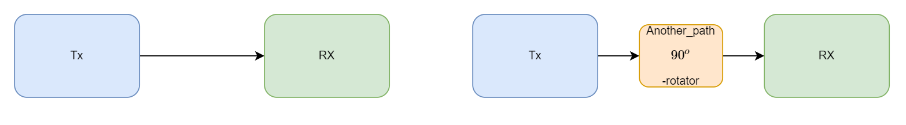

# TX IQImbalance, RX IQImbalance Calibration for Direct Conversion Architecture

- A summary and proposal
- KC Hung

## The Impairment Modeling

- IQ Impairment Sources
  - DAC/ADC IQ latency skew(especially for very high speed AD/DC)
    - different latency causes **linear phase variation** with frequency
  - TRX IQ ALPF response mismatch (wider bandwidth, or A/D Die)
    - different variation causes  **magnitude response variation** with frequency
  - Mixer phase/gain: cause constant **iq coupling** due to phase mismatch and const magnitude response mismatch.
  - In WiFi application, typically LPF response response and mixer iq
- Blockdiagram

- IQ-path View
  - TX Side modeling: 
$$\left[\begin{array}{c}
x_{I}(n) \\
x_{Q}(n)
\end{array}\right]=\left[\begin{array}{cc}
1 & 0 \\
0 & g_t
\end{array}\right]\left[\begin{array}{cc}
\cos (\theta / 2) & -\sin (\theta / 2) \\
-\sin (\theta / 2) & \cos (\theta / 2)
\end{array}\right]\left[\begin{array}{cc}
F_{I t}(n) & \\
& F_{Q t}(n)
\end{array}\right] \otimes\left[\begin{array}{c}
s_{I}(n) \\
s_{Q}(n)
\end{array}\right]$$

  - RX Side modeling: 
$$\left[\begin{array}{c}
y_{I}(n) \\
y_{Q}(n)
\end{array}\right]=\left[\begin{array}{cc}
F_{I r}(n) & \\
& F_{Q r}(n)
\end{array}\right] \otimes\left[\begin{array}{cc}
1 & 0 \\
0 & g_r
\end{array}\right]\left[\begin{array}{cc}
\cos (\theta_r / 2) & \sin (\theta_r / 2) \\
\sin (\theta_r / 2) & \cos (\theta_r / 2)
\end{array}\right]\left[\begin{array}{c}
r_{I}(n) \\
r_{Q}(n)
\end{array}\right]$$ 

- Wide-sense Linear System (WLS) View:
  - WLS model: 
    - $x(t) = F(t)\otimes s(t) + B(t)\otimes s^*(t)$
    - Closure property: cascade of WLS is still WLS
      - $x = F_1 s + B_1 s^*$,$y = F_2 x + B_2 x$
      - $y = F_2(F_1 s+ B_1 s^*)+B_2(F^*_1 s^* + B_1^* s) = (F_1F_2+B_1^*B_2)s +(F_2B_1+F_1^*B_2)s^* = Fs+Bs^*$
    - Linear system is a **WLS**

  - IQ mismatch is a **WLS**
    - $\boldsymbol{x}(n)=F_{\mathrm{t}}(n) \otimes \boldsymbol{s}+B_{\mathrm{t}}(n)\otimes \boldsymbol{s}^{*}$
      - $F_{t}(n)=\left(F_{it}(n)+g_t e^{j \theta_{t}} F_{qt}(t)\right) / 2)$
      - $B_{t}(n)=\left(F_{it}(n)-g_t e^{j \theta_{t}} F_{qt}(t)\right) / 2<<Ft(n)$
      - $F_{r}(n)=\left(F_{ir}(n)+g_r e^{-j \theta_{r}} F_{qr}(t)\right) / 2$
      - $B_{r}(n)=\left(F_{ir}(n)-g_r e^{j \theta_{r}} F_{qr}(t)\right) / 2<<Ft(n)$
    - $\boldsymbol{y}(n)=\gamma_{\mathrm{r}}(n) \otimes \boldsymbol{r}+\beta_{\mathrm{r}}(n)\otimes \boldsymbol{r}^{*}$
   
  - frequency response view of IQ
    - $S_{r}(k)=\Gamma(k) S(k)+\Beta(k)S^{*}(-k)$
    

## The Compensation approach

- IQ compensation $\equiv$ equalization of WLS system

- General Formula

- Time domain compensator
  - TX precomp: $\boldsymbol{s}'(n)= (R_{Ft} - R_{Bt})^{-1}\otimes(F^*_t\otimes\boldsymbol{s} - B_t \otimes \boldsymbol{s}^{*})$
  - Rx comp: $\boldsymbol{r}'(n)= (R_{Fr} - R_{Br})^{-1}\otimes(F^*_t\otimes\boldsymbol{s} - B_t \otimes \boldsymbol{s}^{*})$
  - Simplification : $\boldsymbol{x}^\prime= \boldsymbol{x} - (F^{-*}\otimes B)\otimes \boldsymbol{x}^* = \boldsymbol{x} - W\otimes \boldsymbol{x}^*$ 
- Frequency domain compensator
  -  $S(k)= \frac{1}{|F(k)|^2-|B(k)|^2}\left(F^{*}(k)S_{t}(k) - B(k) S_{t}^{*}(-k)\right)$
  - Simplified: $S(k)= S_{t}(k) -\frac{B(k)}{F^{*}(k)} S_{t}^{*}(-k)$

- Separate FI and FD compensation
  - $s^\prime=s - \frac{B}{F^*}s^*$
  - $s^{\prime\prime} = \Re(s)+(F_Q\otimes F^{-1}_I) \otimes \Im(s)$
  

## Calibration Schemes

- Typical Approaches:
  - TX self calibration:
    - Approach:
      - precisely-defined two-tone training sequence
      - square-circuit(self-mixing or diode)
      - LPF + tone-detection after ADC.
    - Algorithm:
      - Search-based: tone-detector output power as cost-function, adaptive adjust/search compensator coefficient
      - Estimation-based: precisely design training pattern, using tone responses at different frequency to estimate parameter directly
    - Typically handling the FI part. More complicated for handing FD part.
  - RX Self calibration
    - Generate training signal in RF domain
      - single tone or 
      - band-limited white gaussian signal
    - Estimation Algorithm:
      - Search-based : adjust compensator such that image is minimum
      - Adaptive filtering: minimize imaginary part or iq-cross-talk

### Joint TX RX Calibration

- OTA Joint TX IQ and RX IQ, compensate TX IQ/RX IQ Jointly
  - Key idea: TXIQ/CH/RXIQ as WLS system, equalize whole system after estimate equivalent response.
  - Time-domain(SCM): adaptive training of the WLS equalizer
  - Fequency-domain(OFDM,SC-FDE): channel estimation and then compensated-EQ.
  - Requirement: **No CFO** in-between TX and RX 
    - CFO will cause the whole system not a WLS
- Reduce Channel estimation complexity by Golay Complementary Sequence
  - Golay Sequence Properties: 
    - $S_{a L}(r)+S_{a L}(L-r-1)+S_{b L}(r)+S_{b L}(L-r-1)=1$, for $r=0 \ldots \frac{L}{2}-1$
    - $S_{a L}(n) \odot S_{a L}^{\prime}(n)+S_{b L}(n) \odot S_{b L}^{\prime}(n)=0_{L}$
    - $S_{a L}(n) \odot S_{b L}^{\prime \prime}(n)+S_{b L}(n) \odot S_{a L}^{\prime}(n)=0_{L}$
    - $S_{a L}(n) \odot S_{a L}(n)+S_{b L}(n) \odot S_{b L}(n)=2_{L}$
    - $S_{x L}\prime(r) = S_{x L}(L-r-1)$
  - Received Signal (in FD) due to TX FS IQ:
    - $S_{r a}(k)=\Gamma(k) S_{a}(k)+B(k) S_{a}^{\prime}(k)$
    - $S_{r b}(k)=\Gamma(k) S_{b}(k)+B(k) S_{b}^{\prime}(k)$
  - Estimation: 
    - $C_{a}(k) =S_{r a}(k) \odot S_{a}(k)$, $C_{b}(k) =S_{r b}(k) \odot S_{b}(k)$
    - $D_{a}(k) =S_{r a}(k) \odot S_{a}^{\prime}(k)$, $D_{b}(k) =S_{r b}(k) \odot S_{b^{\prime}}(k)$
    - $\Gamma(k)=\frac{1}{2}\left\{S_{r a}(k) \odot S_{a}(k)+S_{r b}(k) \odot S_{b}(k)\right\}$
$B(k)=\frac{1}{2}\left\{S_{r a}(k) \odot S_{a}^{\prime}(k)+S_{r b}(k) \odot S_{b}^{\prime}(k)\right\}$

- Issue: Separation of TX and RX IQ parameters.
  - Only get jointly response typically.
  - If involve channel response, can use affine projection iteratively separate TXIQ/CH/RXIQ
    - estimate CH by given TXIQ/RXIQ using subspace projection estimation
    - estimate TXIQ/RXIQ by given CH  with sub-space projection of TXIQ/RXIQ
    - iteratively estimate the parameters.
  - If channel is "White": no **middle-ware**, TXIQ and RXIQ becomes a single response=> hard to separate it!

## Separation of TXIQ/RXIQ with Jointly Estimation

- Approach 1: TXIQ self-cal or rxIQ self-cal

- Approach 2: Introduce more estimation equations 
  - Comments: fail due to existence of multiple roots for m unknown 2nd-order polynomial equations 
  - In MIMO system (ex 2x2):  
    - TX0 to RX0 and RX1 to get $F_{00}$,$B_{00}$,$F_{01}$,$B_{01}$
    - TX1 to RX0 and RX1 to get $F_{10}$,$B_{10}$,$F_{11}$,$B_{11}$
    - Use $F_{00}$,$B_{00}$,$F_{01}$,$B_{01}$, $F_{10}$,$B_{10}$,$F_{11}$,$B_{11}$ to derive $F_{T0}$,$B_{T0}$,$F_{T1}$,$B_{T1}$,$F_{R0}$,$B_{R0}$,$F_{R1}$,$B_{R1}$ 
     
 - In SISO:
   - Modify Mixer architecture to introduce MixerTx/MixerTxSwap, MixerRx/MixerRxSwap
   - like 2x2 case, estimate 4 set of the parameter and select the one for MixerTx/MixerRx
    

- Approach 3: Introduce middle-ware, change response of the loopback path.
  - Ex. Add controllable phase shift/rotation(ex 90deg shifter) in the path
    - accuracy of shifter affects the performance.
  
  - Ex. Add extra FO between TX/RX 
  
  - Proposal:
    - insert different calibration loopback path: ex. phase shift of the path.
    - separate the tx and rx parameters according to two channel condition.
    - requires the estimation of the "middleware", the gain and the phase estimation.
    - Separate algorithm:
    - The TRX model:
     - path1(original): $w_{1} =F_{r}\left( F_{t} s+B_{t} s^{*}\right) +B_{r}\left( F^{*}_{t} s^{*} +B^{*}_{t} s\right) =\left( F_{r} F_{r} +B_{r} B^{*}_{t}\right) s+\left( F_{r} B_{t} +B_{r} F^{*}_{t}\right) s^{*}$
      - path2(phase-rotate): $w_{2} =W_{r}( \alpha W_{t}( s)) =F_{r}\left( \alpha F_{t} s+\alpha B_{t} s^{*}\right) +B_{r}\left( \alpha ^{*} F^{*}_{t} s^{*} +\alpha ^{*} B^{*}_{t} s\right) =\left( \alpha F_{r} F_{t} +\alpha ^{*} B_{r} B^{*}_{t}\right) s+\left( \alpha F_{r} B_{t} +\alpha ^{*} B_{r} F^{*}_{t}\right) s^{*}$
      - $ \begin{array}{l}
F_{1} =F_{r} F_{t} +B_{r} B^{*}_{t} ,\\
B_{1} =F_{r} B_{t} +B_{r} B^{*}_{t} ,\\
F_{2} =\alpha F_{r} F_{t} +\alpha ^{*} B_{r} B^{*}_{t},\\
B_{2} =\alpha F_{r} B_{t} +\alpha ^{*} B_{r} B^{*}_{t}
\end{array}$
    - We have that:
      - $ \begin{array}{l}
F_{r} F_{t} =\left( \alpha ^{*} F_{1} -F_{2}\right) /\left( \alpha ^{*} -\alpha \right) =A\\
F_{r} B_{t} =\left( \alpha ^{*} B_{1} -B_{2}\right) /\left( \alpha ^{*} -\alpha \right) =C\\
B^{*}_{r} F_{t} =\left( \alpha ^{*} B^{*}_{1} -B^{*}_{2}\right) /\left( \alpha ^{*} -\alpha \right) =D^{*}
\end{array}$
    - And the TX/RX iq mismatch is performed by: 
      - $ \begin{array}{l}
B_{t} /F_{t} =C/A=\left( \alpha ^{*} B_{1} -B_{2}\right) /\left( \alpha ^{*} F_{1} -F_{2}\right)\\
B^{*}_{r} /F_{r} =D^{*} /A=\left( \alpha ^{*} B^{*}_{1} -B^{*}_{2}\right) /\left( \alpha ^{*} F_{1} -F_{2}\right)
\end{array}$ 
  
## Training System Design And Procedure

- Procedure: 
  - For each estimation
    - AGC: fix TX gain, adjust RX gain to make minimum Noise
    - Estimate TRXIQ jointly: iteratively doing the approach
      - Estimate gain offset of two path using time domain Golay sequence with compensated TX,RX IQ mismatch
      - Estimate TX iq compensation using two paths with gain offset
      - Compensate TX, Estimate RX iq compensation using one path.
  - Collect all estimation results => separation of TX/RX mismatch
- Training Pattern
  - Calibration Training sequence
   

- Calibration receiver procedure:
  - Average per symbol and DC removal
  - FFT get frequency response
  - Estimate response by Golay Sequence
  - Generate compensator coefficients by IFFT

## Exercise

- setting: 
  - compensator 6 taps, sysBW="BW80",256pt FFT used
  - IRR = $10\times \log10(|S(k)|^2/|I(k)|^2)$
    - $S(k)=F(k)s(k)$, $I(k)=B(k)s^*(-k)$ 
- case 1: rx-only calibration
  - IQmismatch: +3dB,25deg,5% corner var, cheby1,SNR=15dB
     
  - IQmismatch: +3dB,32deg,5% corner var, cheby1,SNR=30dB
     
- case 2: tx-only calibration
  - IQmismatch: -3dB,-25deg,5% corner var, cheby1,SNR=15dB
     
  - IQmismatch: -3dB,-28deg,5% corner var, cheby1,SNR=30dB
     
- case 3: joint tx/rx
  - TX IQmismatch: +2dB,-15deg,5% corner var, cheby1 
  - RX IQmismatch: -2dB,15deg,-5% corner var, cheby1  
  - SNR = 20dB
     
     
    
- case 4: joint tx/rx
  - TX IQmismatch: +1dB,5deg,5% corner var, cheby1 
  - RX IQmismatch: -1dB,-5deg,-5% corner var, cheby1  
  - SNR = 30dB
     
     
    

- case 5: joint tx/rx
  - TX IQmismatch: +0.5dB,5deg,1% corner var, cheby1 
  - RX IQmismatch: -0.5dB,-5deg,-1% corner var, cheby1  
  - SNR = 30dB
     
     

## Conclusion:

- Joint TX/RX cal is possible, need to introduce different channel response for separate TX/RX 
- Approach of iteratively estimate channel response and TRX iqcal is proposed. 
- 6 taps compensators can provide approaching >50dB IRR( worst case ~ 45-48)
  - SNR requirement is not significant
  - Even very bad iq mismatch, its estimation and compensation still okay to reach ~48-50dB

## Open discussion :

- TX/RX architecture spec:
  - TX: filters, iq-mismatch properties/dependency, DAC properties, loop-back path properties(attenuation,rotation,...)
  - RX: filters, iq-mismatch properties/dependency, LNA/LPF, gain partition,  properties
- Calibration requirements:
  - cal time, power-on, channel switch, thermal change,...

## References:

- [WLS] Bernard Picinbono, Pascal Chevalier. Widely Linear Estimation with Complex Data. IEEE Transac-tions on Signal Processing, Institute of Electrical and Electronics Engineers, 1995, 43, pp.2030 - 2033.
  - https://hal-centralesupelec.archives-ouvertes.fr/hal-01756249
- [GolaySeqEst] R. Rodrıguez-Avila,et.al. "Frequency-Selective Joint T x/Rx I/Q Imbalance Estimation Using Golay Complementary Sequences", IEEE RANSACTIONS ON WIRELESS COMMUNICATIONS, VOL. 12, NO. 5
  - 10.1109/TWC.2013.040213.120622
- [TXSelfMixing] "Built-In Self-Test of Transmitter I/Q Mismatch and
Nonlinearity Using Self-Mixing Envelope Detector", IEEE TRANSACTIONS ON VERY LARGE SCALE INTEGRATION (VLSI) SYSTEMS 
  - 10.1109/TVLSI.2014.2308317
- [TXSelfmixing] Ainhoa Rezola, et.al., "Built-in-Self-Calibration for I/Q Imbalance in Wideband Millimeter-Wave Gigabit Transmitters", IEEE TRANSACTIONS ON MICROWAVE THEORY AND TECHNIQUES 2017
  - 10.1109/TMTT.2017.2712145
- [TXDiodeTwoTone] Wei Li, et.al., "Self-IQ-Demodulation Based Compensation Scheme of Frequency-Dependent IQ Imbalance for Wideband Direct-Conversion Transmitters"
  - IEEE TRANSACTIONS ON BROADCASTING, VOL. 61, NO. 4
- [TRXFdelta]  Björn Debaillie, et.al, "Calibration of Direct-Conversion Transceivers,"  IEEE JOURNAL OF SELECTED TOPICS IN SIGNAL PROCESSING, VOL. 3, NO. 3
- [TRXFdelta] Chen-Jui Hsu and Wern-Ho Sheen, "Joint Calibration of Transmitter and Receiver Impairments in Direct-Conversion Radio Architecture",  IEEE TRANSACTIONS ON WIRELESS COMMUNICATIONS, VOL. 11, NO. 2, FEB. 2012